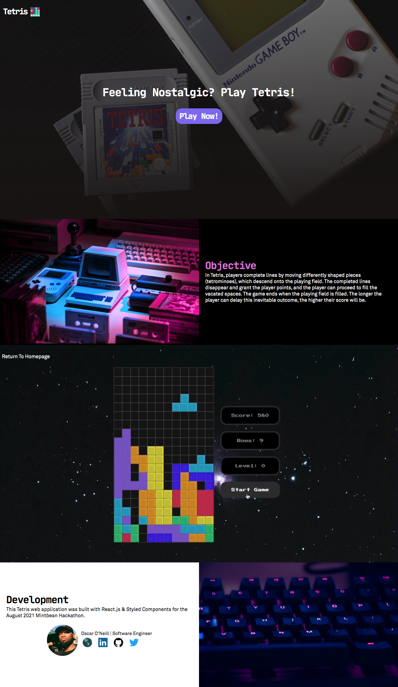
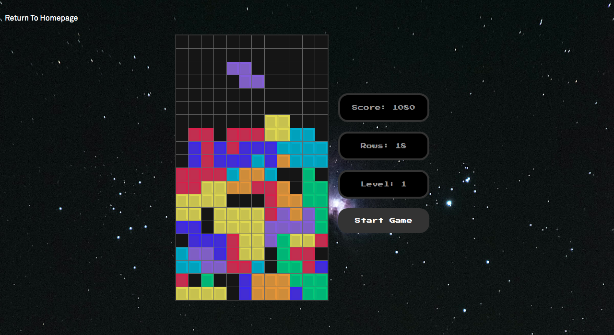

# Welcome to Tetris

### View the live website <a href='https://retrotetris.vercel.app/' target='_blank' rel='noreferrer noopener'>here<a>.

### This project was created using React.js & Styled Components.

## Developed by Oscar O'Neill
* <a href='https://oscaroneill.xyz' target='_blank' rel='noreferrer noopener'>Portfolio</a>
* <a href='https://www.linkedin.com/in/oscarone/' target='_blank' rel='noreferrer noopener'>LinkedIn</a>
* <a href='https://github.com/oscar-oneill' target='_blank' rel='noreferrer noopener'>Github</a>
* <a href='https://twitter.com/oscaroneilljs' target='_blank' rel='noreferrer noopener'>Twitter</a>

## Landing Page


## Gameplay Screenshot



## Getting Started
1. Clone this repository.

   ```
   git clone https://github.com/oscaroneill/tetris.git
   ```

2. Install the dependencies located in the package.json file.

   ```
   npm install
   ```

3. Start the app; this command runs the app in the development mode.
Open [http://localhost:3000](http://localhost:3000) to view it in the browser.

   ```
   npm start
   ```

